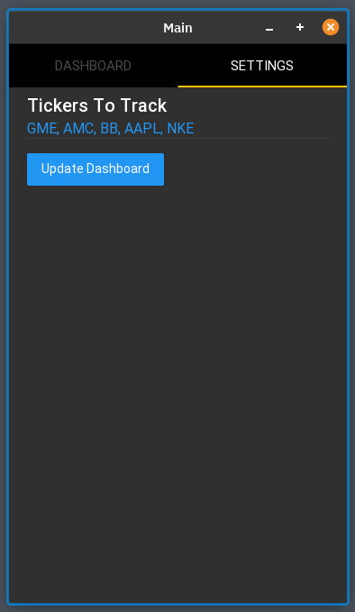
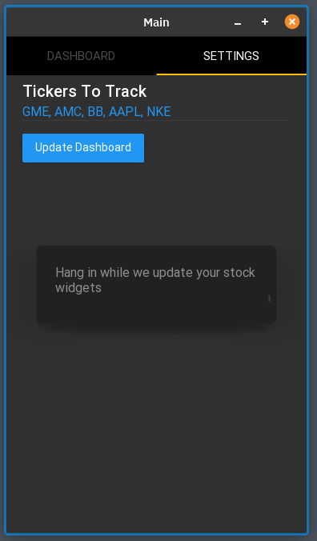

# kivy-stonks-app

- [Table of Contents](#table-of-contents)
- [Quiz App - Final Project for Python Class](#quiz-app---final-project-for-python-class)
  - [Local Setup - macOS - using ZSH shell](#local-setup---macos---using-zsh-shell)
  - [Local Setup - Linux - Pop! OS - using ZSH shell - Debian Based (Ubuntu, Pop! OS, Linux Mint, etc.)](#local-setup---linux---pop-os---using-zsh-shell---debian-based-ubuntu-pop-os-linux-mint-etc)

# Kivy Stonks App - ticker price tracking app made in kivy - 100% Python

Stonks is a simple app with two tabs: Dashboard and Settings

Settings Tab contains a plain input field which expects a comma separated list of tickers. Once the tickers are entered, user updates the Dashboard tab by pressing the "Update dashboard" button.



Dashboard Tab displays candle charts for the period of 45 days and the last price of tickers set in the Settings Tab


Created by Asia, Bogdan and Antoni.

## Local Setup - macOS - using ZSH shell

Install pyenv build dependencies.

```bash
# Xcode Command Line Tools
xcode-select --install

# Other dependencies
brew install openssl readline sqlite3 xz zlib
```

Install pyenv with Homebrew.

```bash
brew update
brew install pyenv
```

Install Python 3.9.0

```bash
pyenv install 3.9.0
```

Clone the repository.

```bash
cd [direcotry you want for this project]
git clone [this repo clone link]
cd python-sem5-final-project
```

Set a local version for Python (for current direcotry only).

```bash
# Set version
pyenv local 3.9.0
# Check version
pyenv version
```

Install poetry (package manager) via curl.

```bash
# Install
curl -sSL https://raw.githubusercontent.com/python-poetry/poetry/master/get-poetry.py | python -

# Verify
poetry --version
```

Install a pre-existing poetry project with dependencies.

```bash
# Assuming youre in repository root
# Navigate to project folder
cd quiz-app
# Install poetry project
poetry install
```

Place `firebase-secret.json` into `quiz-app` directory. Contact repo owner if you did not receive the file.

Run test script to verify that setup is complete.

```bash
# Start a poetry shell
poetry shell

# Inside the shell now
poetry run python ./quiz_app/__init__.py
```

Done! You can now run and develop painlessly.

## Local Setup - Linux - Pop! OS - using ZSH shell - Debian Based (Ubuntu, Pop! OS, Linux Mint, etc.)

Install pyenv build dependencies.

```bash
# Update apt
sudo apt update
# Install dependencies
sudo apt install --no-install-recommends make build-essential libssl-dev zlib1g-dev libbz2-dev libreadline-dev libsqlite3-dev wget curl llvm libncurses5-dev xz-utils tk-dev libxml2-dev libxmlsec1-dev libffi-dev liblzma-dev
```

Check out pyenv where you want it to be installed and clone the repository.

```bash
mkdir ~/.pyenv
cd ~./pyenv
git clone https://github.com/pyenv/pyenv.git
```

Define environment variable `PYENV_ROOT`.

```bash
echo 'export PYENV_ROOT="$HOME/.pyenv"' >> ~/.[your-shell-config-file, e.g. .bashrc, .zshrc]
echo 'export PATH="$PYENV_ROOT/bin:$PATH"' >> ~/.[your-shell-config-file, e.g. .bashrc, .zshrc]
source ~/.[your-shell-config-file, e.g. .bashrc, .zshrc]
```

Install Python 3.9.0 (may take a while)

```bash
pyenv install 3.9.0
```

If you encounter script location warning do this

```bash
echo 'export PYENV_V_THREE_NINE_ZERO="$HOME/.pyenv/versions/3.9.0"'
echo 'export PATH="$PYENV_V_THREE_NINE_ZERO/bin:$PATH"'
source ~/.[your-shell-config-file, e.g. .bashrc, .zshrc]
pyenv install 3.9.0
```

Clone the repository.

```bash
cd [directory you want for this project]
git clone [this repo clone link]
cd python-sem5-final-project
```

Set a local version for Python (for current direcotry only).

```bash
# Set version
pyenv local 3.9.0
# Check version
pyenv version
```

Install poetry (package manager) via curl.

```bash
# Install
curl -sSL https://raw.githubusercontent.com/python-poetry/poetry/master/get-poetry.py | python -

# Source shell config
source ~/.[your-shell-config-file, e.g. .bashrc, .zshrc]

# Verify
poetry --version
```

Install a pre-existing poetry project with dependencies.

```bash
# Assuming youre in repository root
# Navigate to project folder
cd quiz-app
# Install poetry project
poetry install
```

Place `firebase-secret.json` into `quiz-app` directory. Contact repo owner if you did not receive the file.

Run test script to verify that setup is complete.

```bash
# Start a poetry shell
poetry shell

# Inside the shell now
poetry run python ./quiz_app/__init__.py
```

Done! You can now run and develop painlessly.
